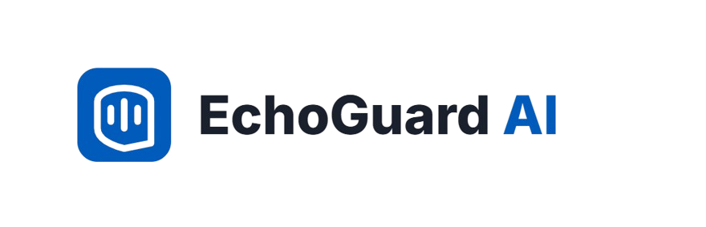

  
  
  <h1>EchoGuard AI</h1>
  
<b>Real-time On-Device AI Voice Risk Protection</b>

  
<i>Safeguarding Vulnerable Citizens in the Age of Generative AI Scams</i>

  

    
    
    
    
  

> **EchoGuard AI** is a real-time, on-device digital guardian designed to restore fundamental trust in telecommunications. By analyzing audio locally, it protects everyday citizens from voice scams (vishing) and deepfakes without compromising personal privacy.

---

## 📑 Table of Contents
* [About EchoGuard AI](#-about-echoguard-ai)
* [Core Differentiators](#-core-differentiators)
* [How to Use (Web Simulator)](#-how-to-use-the-app-web-simulator)
* [Edge-Native Security Framework](#-edge-native-security-framework)
* [Performance & Efficiency](#-performance--efficiency)
* [Ethical Governance](#-ethical-governance--compliance)
* [Strategic Roadmap](#-strategic-roadmap)

---

## 📖 About EchoGuard AI

In an era where cybercriminals can clone voices using generative AI in just **3 seconds** to trick vulnerable populations, traditional cloud-based defenses fail due to fatal live-call latency and privacy violations. 

EchoGuard AI protects everyday citizens—especially seniors, students, and busy families—from voice scams and deepfake calls while keeping personal conversations strictly confidential.

### 🌟 Core Differentiators

* **🔒 100% Private & Local:** All audio analysis, speech recognition, and intent understanding happen locally inside your phone's processor. Zero cloud streaming ensures total data sovereignty.
* **🤝 Helpful, Not Controlling:** It acts as an advisory co-pilot. It never cuts off your phone calls or interferes without your consent; it provides a gentle, transparent HUD alert.
* **🛑 Privacy Switch Engaged:** The moment an authentic human voice is verified, EchoGuard AI immediately stops monitoring to ensure complete privacy.
* **🧠 Empowering through MIL:** Integrated with Media and Information Literacy (MIL) principles. It explains *why* a call is risky, turning threats into literacy training moments.

---

## 🚀 How to Use the App (Web Simulator)

Experience how the system protects you during a live smartphone call through our interactive web demo:

* **Step 1: Choose a Test Call Scenario**
  Upload an audio file (`.m4a`, `.wav`, or `.mp3`) simulating a scam, delivery notice, or family conversation. The system will load the call scenario into the smartphone simulation frame.
* **Step 2: Receive the Incoming Call**
  Check the Caller Information (e.g., "Global Standard Bank" or "Unknown Caller") and status badge. Choose to **ACCEPT** (Green Button) to start live inspection.
* **Step 3: Read Smart HUD Alerts During the Call**
  As the audio plays, EchoGuard AI quietly monitors the stream buffer. Watch the banner for real-time risk indicators:
  > **🚨 Red Alert (HIGH_RISK):** Critical Scam Detected! (AI voice cloning, fake legal threats, OTP theft). *Action: Hang up immediately.*
  > **⚠ Orange Alert (MEDIUM_RISK):** Unverified AI Voice Detected. No explicit scam intent yet, but exercise caution.
  > **ℹ️ Green Alert (LOW_RISK):** Official Automated Service (e.g., package delivery notice).
  > **✅ Green Safe (HUMAN_VOICE):** Real Human Speech Verified. *Privacy Switch Engaged — Monitoring Stops!*
* **Step 4: Review Your Safety Diagnosis**
  After the call, review the final pipeline report detailing Voice Source Metric (AI vs. Human confidence), Harm Intent, and the final Risk Level.

---

## 🛡️ Edge-Native Security Framework

A multi-layered defense mechanism operating efficiently on the edge:

1. **Voice Provenance (Wav2Vec2 Acoustic Analysis):** Secures the local entry point using C2PA & SynthID standard metadata.
2. **Harm Assessment (SLM Intent Analysis):** Scans speech locally in real-time to intercept social engineering patterns.
3. **Mitigation (Risk Tiering):** Automates instant, proactive UI safety nudges and defensive warnings.

---

## ⚡ Performance & Efficiency

Optimized for global accessibility and budget hardware:

| Metric | Details |
| :--- | :--- |
| **Latency** | Sub-30ms execution for real-time feedback. |
| **Footprint** | ~25MB using a highly optimized ONNX INT8 Engine. |
| **Robustness** | Resilient across GSM/VoIP audio codecs via data augmentation. |

---

## 📜 Ethical Governance & Compliance

Aligned with the **[UNESCO Recommendation on the Ethics of AI (2021)](https://www.unesco.org/en/artificial-intelligence/recommendation-ethics)**:

* **Proportionality & Fairness:** EIA compliance mandates rigorous mitigation of accent bias, ensuring non-discriminatory service across diverse linguistic backgrounds.
* **Human Oversight:** Human-in-the-loop governance ensures that automated processes always defer to user agency.
* **Safety & Security:** Architected with adversarial hardening to prevent malicious exploitation.

---

## 🗺️ Strategic Roadmap

From local protection to a global standard:

* **Phase 1:** Android/iOS Release & NGO pilots to establish foundational trust with community partners.
* **Phase 2:** Telecom Integration for deep scaling through infrastructure partnerships.
* **Phase 3:** Open-Source Core transitioning to a global public utility for transparent community development and audit.
